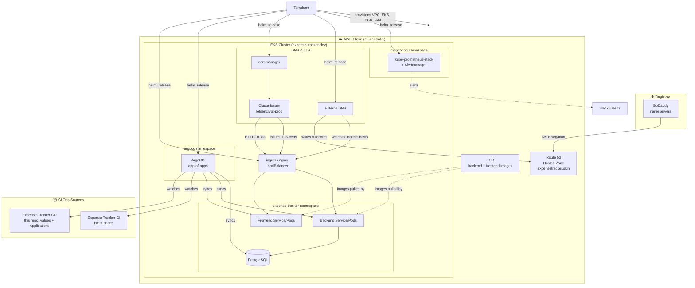

<div align="center">

# expense-tracker-infra

**Infrastructure-as-Code that deploys the Expense Tracker app to AWS EKS — full GitOps, DNS, and HTTPS automation, one `terraform apply` away.**

[](https://www.terraform.io/)
[](https://aws.amazon.com/)
[](https://kubernetes.io/)
[](https://argo-cd.readthedocs.io/)
[](https://helm.sh/)
[](https://letsencrypt.org/)

</div>

<div align="center">
  
</div>

<div align="center">

🔗 **Live:** [https://expensetracker.skin](https://expensetracker.skin) — a real, publicly-accessible HTTPS deployment.

</div>

## Overview

Expense Tracker is a full-stack app for logging income/expenses, tracking budgets, and visualizing spending. This repository is **not the app** — it's the infrastructure that runs it: Terraform provisions a VPC and EKS cluster on AWS, installs the platform add-ons (ingress, TLS, DNS, GitOps, monitoring) via Helm, and ArgoCD takes over from there, continuously syncing the app's Kubernetes manifests from Git.

## 🏗️ Architecture



> GitHub renders Mermaid diagrams natively — click to zoom/pan directly in the file view.

## 📦 Tech Stack

| Layer | Tools |
|---|---|
| **IaC** | Terraform (`~> 1.6`) |
| **Cloud** | AWS: EKS, VPC, ECR, Route 53, IAM (OIDC/IRSA) |
| **Orchestration** | Kubernetes 1.31, Helm |
| **GitOps** | ArgoCD (app-of-apps pattern) |
| **Ingress / TLS** | ingress-nginx, cert-manager, Let's Encrypt (HTTP-01) |
| **DNS** | ExternalDNS, Route 53 |
| **Observability** | kube-prometheus-stack (Prometheus, Grafana, Alertmanager), Slack alerts |
| **App** | React frontend, Python/FastAPI-style backend (JWT auth), PostgreSQL 16 |

## 🚀 Prerequisites

- [Terraform](https://developer.hashicorp.com/terraform) `>= 1.6`
- AWS CLI, configured with credentials for the target account
- An AWS account with permissions to create VPC/EKS/IAM/Route53 resources
- A registered domain with its nameservers delegated to Route 53 (one-time GoDaddy → Route53 NS update — see `bootstrap` output)
- `kubectl` (optional — only needed if you want to inspect the cluster directly; the app deploys itself via ArgoCD)

## Getting Started

### 1. One-time bootstrap

The state backend and the Route 53 hosted zone live outside `envs/dev` so they survive environment teardown:

```bash
cd bootstrap
terraform init
terraform apply
terraform output route53_name_servers   # set these 4 values as GoDaddy's nameservers (one-time)
terraform output backend_config_hcl     # paste into envs/dev/backend.hcl
```

### 2. Configure

```bash
cd envs/dev
cp terraform.tfvars.example terraform.tfvars
cp backend.hcl.example backend.hcl
```

Fill in `terraform.tfvars`: `github_repo`, `letsencrypt_email`, and optionally `slack_webhook_url` (gitignored — never committed, and never stored anywhere but the tfvars file and Terraform state).

### 3. Deploy

```bash
cd envs/dev
terraform init -backend-config="backend.hcl"

# Stage 1: build the cluster + core add-ons
terraform apply -target=module.platform -target=helm_release.argocd -target=helm_release.ingress_nginx -target=helm_release.cert_manager -target=helm_release.external_dns -target=helm_release.kube_prometheus_stack

# Stage 2: apply the ArgoCD root-app + Let's Encrypt issuer (needs the cluster to exist first)
terraform apply
```

Two stages because the `kubernetes_manifest` resources (the ArgoCD root Application and the Let's Encrypt `ClusterIssuer`) need a live cluster API to plan against — they can't be planned in the same pass that creates the cluster.

### 4. Access

Give it ~15–20 minutes for the cluster, add-ons, and ArgoCD sync to settle. The app is then live at **https://expensetracker.skin** with a valid Let's Encrypt certificate — no manual `kubectl` required.

### 5. Tear down

```bash
cd envs/dev
terraform destroy
```

The `bootstrap` layer (state bucket, lock table, Route 53 zone — ~$0.50/month) intentionally persists so the domain's nameservers stay stable across rebuilds. Only destroy it if you're done with the project for good.

## How It Works

**Two-layer design.** `bootstrap` holds anything that must outlive a teardown — the Terraform state backend and the Route 53 hosted zone (its NS records can't change without redoing the GoDaddy delegation). `envs/dev` holds everything disposable: the cluster, add-ons, and app secrets. This keeps the expensive, ephemeral parts cheap to destroy and rebuild without touching DNS.

**GitOps flow.** ArgoCD runs a single "app-of-apps" `Application` that watches this repo's `gitops/dev` directory. That, in turn, owns the backend, frontend, and database `Applications`, each pulling its Helm chart from the app's CI repo and its environment values from here. A push to either repo is picked up and auto-synced — no manual `kubectl apply`.

**Automatic DNS + TLS.** ExternalDNS watches Ingress resources and writes matching records into the Route 53 hosted zone. cert-manager's `ClusterIssuer` requests certificates from Let's Encrypt via HTTP-01 challenges served through the same nginx ingress, so every Ingress gets a valid cert with no manual steps.

**Full automation.** A `terraform apply` brings up the cluster, installs every add-on, generates the backend's JWT secret, and (once ArgoCD is up) deploys the app itself — end to end, with zero manual `kubectl` intervention required for a working HTTPS deployment.

## Project Structure

```text
bootstrap/          # Persistent: S3 state bucket, DynamoDB lock table, Route 53 hosted zone
envs/dev/            # Disposable: calls modules/platform, installs Helm add-ons, wires DNS/TLS/secrets
modules/platform/    # Reusable module: VPC, EKS, ECR, GitHub OIDC IAM role, EBS CSI driver
gitops/dev/          # ArgoCD Application manifests + per-env Helm values for the app
```

## 💰 Cost

- **Running:** roughly **$5/day** — EKS control plane, NAT gateway, one spot worker node, and a load balancer.
- **Destroyed:** roughly **$0.50/month** — just the Route 53 hosted zone kept alive in `bootstrap`.

## Troubleshooting

<details>
<summary><strong>Terraform errors with "no client config" during apply</strong></summary>

This happens if the `kubernetes_manifest` resources (ArgoCD root app, Let's Encrypt issuer) are planned before the cluster exists. Use the two-stage apply shown in [Getting Started](#3-deploy).
</details>

<details>
<summary><strong>Terraform state is stuck locked</strong></summary>

A previous run was interrupted mid-apply. Run `terraform force-unlock <LOCK_ID>` (the ID is printed in the error message).
</details>

<details>
<summary><strong>`terraform destroy` hangs or fails deleting ECR repositories</strong></summary>

ECR repositories can't be deleted while they still hold images. Empty the `expense-tracker-backend` / `expense-tracker-frontend` repos first, or re-run destroy after emptying them.
</details>
